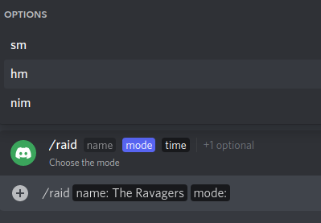
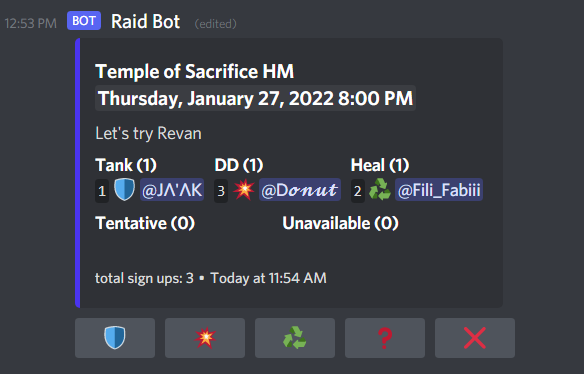

# raid-bot

An intuitive way to manage Raids as an online community using a simple discord-bot.


## Installation

Create a .env file containing your bot token

```
BOT_TOKEN = "your-token"
```


### Requirements

The raid-bot required discord.py oder pycord 2.0 or higher

````commandline
pip install -r requirements.txt
````

## Usage

### Getting started
In order to start the bot use:

````commandline
python raid_bot/main.py 
````

### Usage in Discord

Due to the design of slash commands help for each parameter will be displayed alongside each option:



Setting the time can be done by typing date and time e.g `22.01.2022 22:00` or `01/22/2022 9pm`.
It is also possible to specify the date by using the next day and a time e.g. `Friday 8pm`.
When there's only the time specified the event will be scheduled for this day.




## Command overview

### Scheduling commands

| Command                                                        | Example                                                                                   | Notes                                                                                                                                                                                                        |
|----------------------------------------------------------------|-------------------------------------------------------------------------------------------|--------------------------------------------------------------------------------------------------------------------------------------------------------------------------------------------------------------|
| **/setup** \<name\>                                            | /setup Team-A                                                                             | Creates a setup sign-up message. All user that sign up will be automatically signed up for any raids that use this setups name in its configuration.                                                         |
| **/raid** \<name\> \<mode\> \<time\> \[description\] \[setup\] | /raid Terror from beyond NIM tomorrow 20:00, <br> /raid Dxun SM fri 8pm be on time Team-A | Schedules a Raid. Name and mode parameters can be chosen from a dropdown menu. Description and setup are optional.                                                                                           |
| **/calendar**                                                  | /calendar channel                                                                         | Provides an overview of all scheduled runs for the upcoming week, with direct links to the raid posts. This command will only have to be run once as the calendar will automatically populate with new runs. |


### Poll commands
| Command                                                            | Example                                      | Notes                                                                                                                                                                                                                                                                                                                    |
|--------------------------------------------------------------------|----------------------------------------------|--------------------------------------------------------------------------------------------------------------------------------------------------------------------------------------------------------------------------------------------------------------------------------------------------------------------------|
| **/opinion** \<on\>                                                | /opinion Does ananas belong on pizza?        | Creates a simple yes/no/I don't care poll. Displays the ratio of up and down votes immediately                                                                                                                                                                                                                           |
| **/poll** \question\> \<number_of_options\> \[multiple_selection\] | /poll Next? 4 True, <br> /poll How was it? 2 | Shows the author a dialog in which they can specify the answer options. Only the number of votes is displayed immediately. When the author ends the poll the results will be displayed. The option to select multiple answers is by default disabled, but can be enabled. Currently up to 5 answer options are supported |
| **/random_choice** \<number_of_options\>                           | /random_choice 5                             | Returns a random value from the in the modal supplied list. Up to 5 options are supported.                                                                                                                                                                                                                               |


